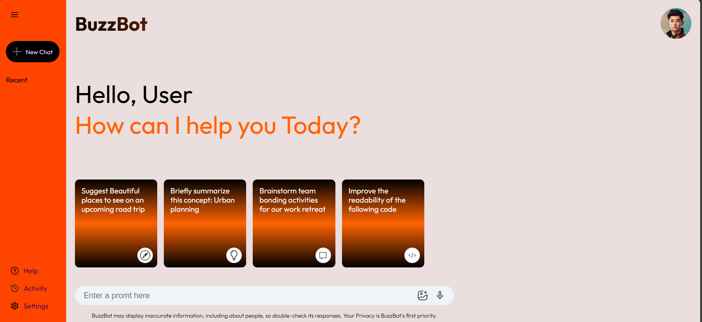

# 🤖 BuzzBot – Your AI Gemini Companion

BuzzBot is a sleek and intelligent AI chatbot inspired by **Google Gemini**, built using **React + Vite** for blazing-fast performance. Whether you're a developer, student, or AI enthusiast, BuzzBot provides real-time conversational AI with a clean and modern UI.

 

---

## 🚀 Features

- 💬 Chat with an AI assistant in real time
- ⚡ Built with React + Vite for ultra-fast rendering
- 🎨 Beautiful, responsive UI with modern styling
- 🌙 Dark mode support (optional)
- 📦 Clean codebase, perfect for learning or extending

---

## 🛠️ Tech Stack

| Tech        | Purpose                |
|-------------|------------------------|
| React       | UI Library             |
| Vite        | Frontend Build Tool    |
| CSS / Tailwind | Styling (if used)      |
| OpenAI API (Optional) | Chatbot engine (if integrated) |

---

## 📦 Getting Started

### 1. Clone the repository
```bash
git clone https://github.com/mansikanchan2003/buzzbot.git
cd buzzbot
2. Install dependencies
npm install

3. Start the dev server
npm run dev
Visit http://localhost:5173 in your browser 🎉

🎯 Upcoming Features
🧠 GPT / Gemini API integration

💾 Chat history and storage

🗂️ Multi-chat sessions

📱 Mobile-first design

👩‍💻 Author
Mansi Kanchan
📧 kanchan.mansi2003@gmail.com
🔗 LinkedIn : www.linkedin.com/in/mansi-kanchan-7924b0196
💻 GitHub : @mansikanchan2003

⭐ Show your support
If you like this project, give it a ⭐ on GitHub and feel free to contribute!

📝 License
This project is open source and available under the MIT License.

## 📂 Project Structure

